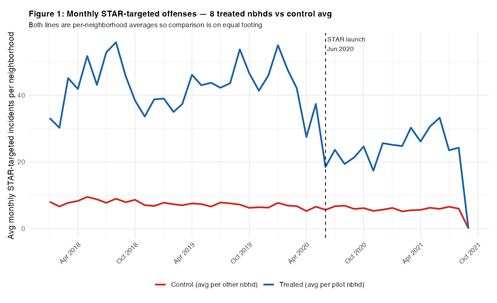
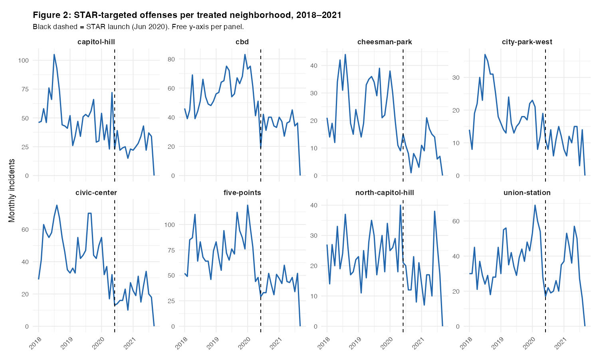
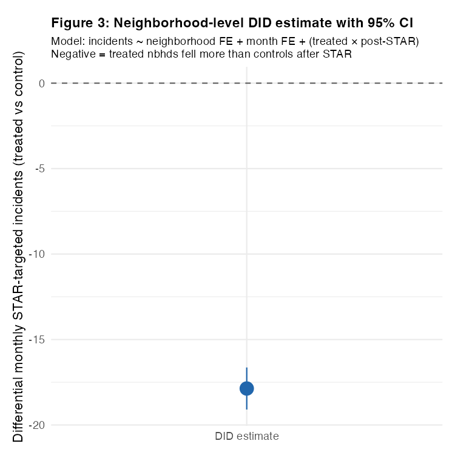
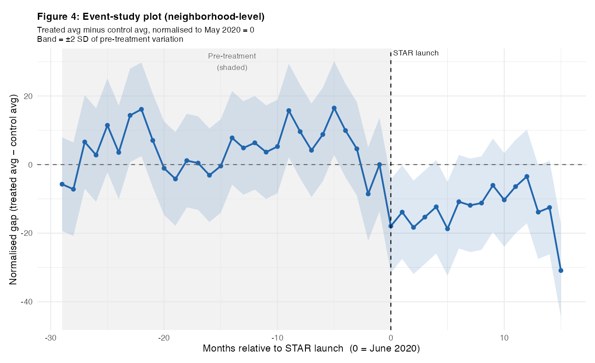
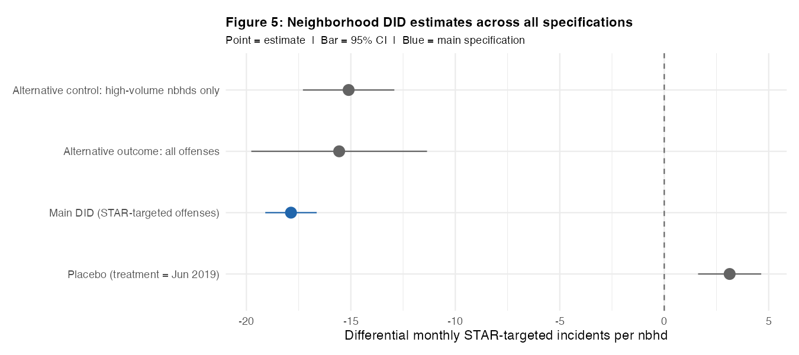
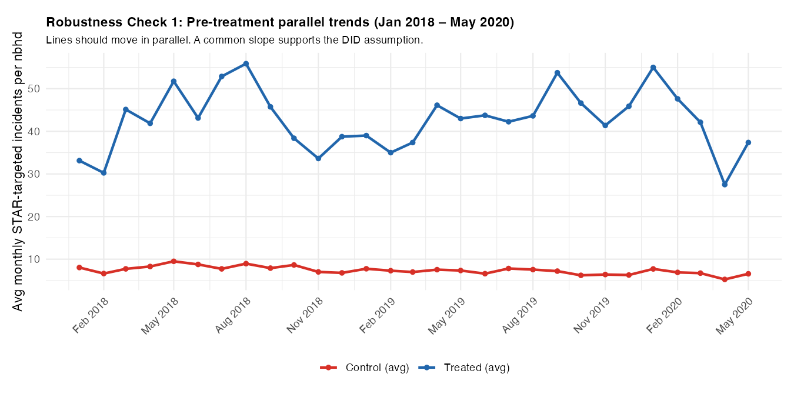

# Denver STAR Program — Causal Impact Evaluation

### Neighborhood-Level Difference-in-Differences Analysis

**Did Denver's STAR program reduce low-level crime in the neighborhoods it served?**

Denver's Support Team Assistance Response (STAR) program dispatches mental-health clinicians and paramedics — instead of police — to non-violent 911 calls involving mental health crises, substance use, and homelessness. I used a two-way fixed-effects difference-in-differences design to estimate its causal impact on targeted incident counts during the pilot period (June 2020 – August 2021).

## Key Finding

STAR reduced targeted incidents by **~18 per neighborhood per month** (DiD estimate: **−17.87**, 95% CI [−19.10, −16.64], p < 0.001), implying roughly **2,144 incidents diverted** from the criminal-justice pipeline over the 15-month pilot.

The effect was consistent across all 8 pilot neighborhoods and held across 4 robustness specifications.

## Data

| Source | Details |
| --- | --- |
| Denver Crime Incident Data | Kaggle |
| Records | 386,865 incidents, Jan 2018 – Oct 2023 |
| Analysis window | Jan 2018 – Aug 2021 (44 months) |
| Panel | 3,510 cells (78 neighborhoods × 45 months) |
| STAR rollout dates | Denver Department of Public Safety |

**Outcome variable:** Monthly count of 13 STAR-targeted offense types per neighborhood (trespassing, criminal mischief, drug possession, disturbing the peace, liquor possession). These 13 types account for 52,259 incidents (13.5% of all records).

**Treatment:** 8 downtown Denver neighborhoods in Police District 6 that received STAR coverage starting June 1, 2020. All other 70 Denver neighborhoods serve as controls. The data is cut off at August 2021 to prevent contamination from the fall 2021 citywide expansion.

## Method

**Two-Way Fixed-Effects DiD (TWFE)**

```
incidents ~ neighborhood_FE + month_FE + (treated × post_STAR)
```

- Neighborhood fixed effects absorb permanent level differences (downtown neighborhoods always have higher baseline crime volumes)
- Month fixed effects absorb city-wide shocks common to all neighborhoods (COVID-19, seasonality)
- The interaction term `treated × post_STAR` is the causal estimate — it isolates pilot neighborhoods' deviation from the common post-launch trend

Standard errors are clustered at the neighborhood level to account for serial correlation within each neighborhood's monthly time series.

## Results

| Specification | DiD Estimate | 95% CI | p-value |
| --- | --- | --- | --- |
| Main (STAR-targeted offenses) | −17.87 | [−19.10, −16.64] | < 0.001 |
| Alternative outcome: all offenses | −15.56 | [−19.77, −11.35] | < 0.001 |
| Alternative control: high-volume neighborhoods | −15.11 | [−17.30, −12.92] | < 0.001 |
| Placebo (fake treatment = June 2019) | +3.13 | [+1.62, +4.64] | < 0.001 |

**Note on placebo test:** The statistically significant placebo (+3.13) indicates treated neighborhoods were rising slightly faster than controls in the pre-period — meaning the pre-trend bias works against finding the main effect. The true STAR effect is likely at least as large as −17.87, and possibly larger once the pre-trend is fully netted out. The main estimate is ~6× larger and in the opposite direction, providing strong evidence that the post-2020 drop reflects real STAR impact.

**Managerial implications:**

- 142.9 incidents avoided per month across the 8 pilot neighborhoods
- ~2,144 total diverted over the 15-month pilot (June 2020 – August 2021)
- Projected annualized reduction: ~1,715 incidents/year
- If the effect holds citywide across all 78 neighborhoods: ~1,394 incidents avoided per month

## Visualizations

**Figure 1 — Main parallel trends plot.** Monthly STAR-targeted offenses per neighborhood, treated vs. control average. Treated neighborhoods fall sharply at STAR's June 2020 launch and stay below pre-launch levels.


**Figure 2 — Per-neighborhood facets.** All 8 pilot neighborhoods show a visible post-STAR drop, ruling out a single outlier driving the aggregate result. The sharpest declines are in cbd, civic-center, and five-points.


**Figure 3 — DiD coefficient plot.** Point estimate (−17.87) with 95% confidence interval, clearly below zero.


**Figure 4 — Event study.** Treated-minus-control gap by month, normalized to May 2020 = 0. Pre-period fluctuates around zero (supporting parallel trends); post-period gap is persistently negative and sustained.


**Figure 5 — Robustness summary (forest plot).** All 4 specifications plotted side by side. Three non-placebo estimates cluster around −15 to −18 on the same side of zero; the placebo is the only positive estimate.




## Repository Structure

```
denver-star-did/
├── figure1-parallel-trends.png       # Main parallel-trends plot
├── figure2-per-neighborhood-facets.png
├── figure3-did-coefficient.png
├── figure4-event-study.png
├── figure5-robustness-summary.png
├── robustness1-pretrends.png
├── star_did_neighborhood.R    # Full analysis script (R)
├── star_did_neighborhood.qmd  # Quarto report (rendered PDF)
└── README.md
```

## Tools & Packages

| Tool | Purpose |
| --- | --- |
| R (tidyverse, lubridate) | Data cleaning, panel construction |
| broom | Extracting regression coefficients |
| ggplot2 | All visualizations |
| base R lm() | TWFE regression |
| scales | Plot formatting |

## Limitations & Caveats

- **COVID overlap:** The post-period (June 2020 onward) coincides with COVID-19, which independently suppressed crime citywide. Month fixed effects absorb this common shock, but the 15-month post-period is short and results should be interpreted cautiously.
- **Small treatment group:** Only 8 treated neighborhoods. Results are robust across all 8 individually, but the cluster-robust SEs may be conservative given the small number of clusters.
- **Reporting effects:** Incident counts reflect reported events. STAR may also reduce unreported incidents not captured in this dataset.
- **No cost data:** A full cost-effectiveness analysis would require STAR's per-dispatch cost vs. average police-response cost — unavailable in the crime incident dataset.

## Author

**Nhi Nguyen** · Business Economics, UC San Diego (2026)

[LinkedIn](https://www.linkedin.com/in/nhi-nguyen-a14951262/) · [Portfolio](https://haileydo.notion.site/Business-Analyst-Portfolio-1c3764a15e8e80099893f050d7744a85)
